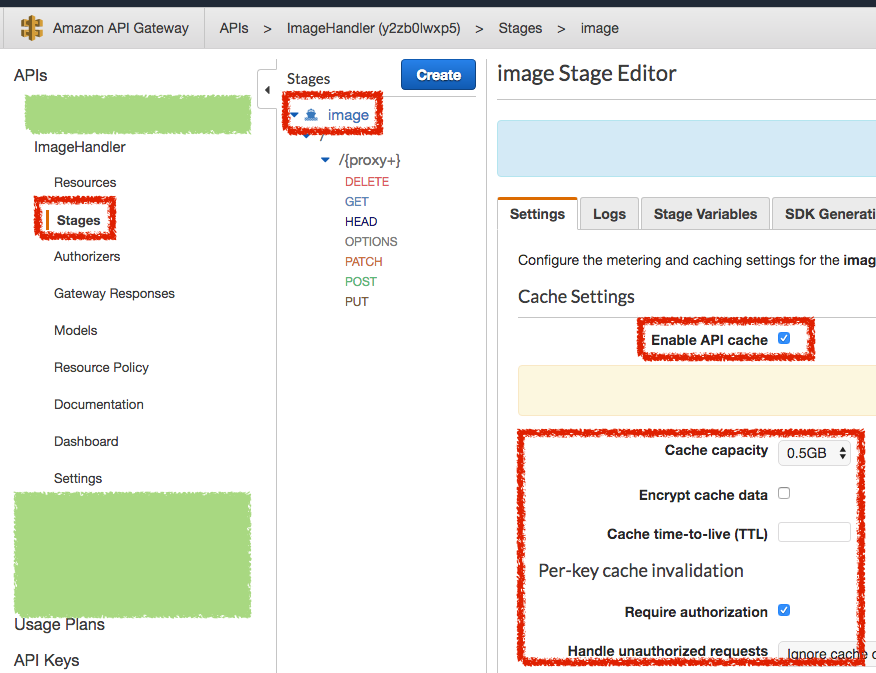

# AWS API Gateway 快取

## 設定快取

在 API Gateway 的 `Stage Editor`，在 `Setting` 的頁籤中點選 `Enable API cache` 就可以看到快取的相關設定

## 參考資料
* [启用 API 缓存以增强响应能力 - Amazon API Gateway](https://docs.aws.amazon.com/zh_cn/apigateway/latest/developerguide/api-gateway-caching.html)
* [Enable API Caching to Enhance Responsiveness - Amazon API Gateway](https://docs.aws.amazon.com/zh_tw/apigateway/latest/developerguide/api-gateway-caching.html)