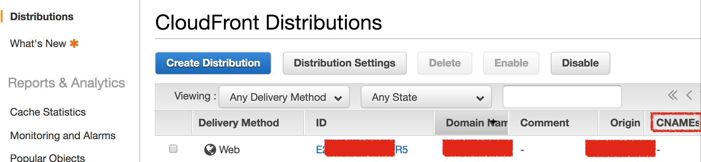
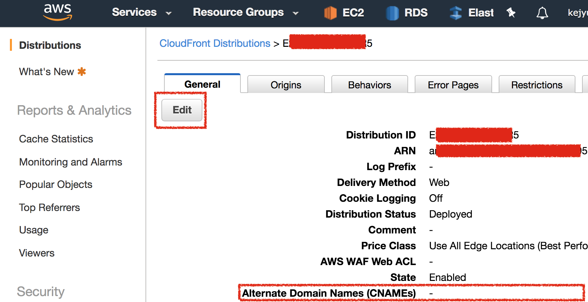
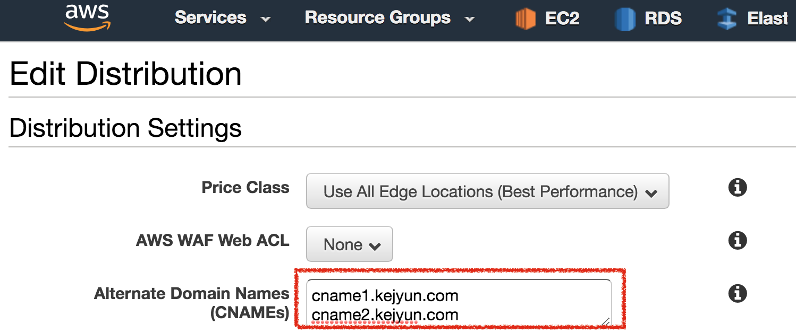

# Cloudflare CNAME to Cloudfront

在 [AWS CloudFront Management Console](https://console.aws.amazon.com/cloudfront/home) 中可以看到有的 Cloudfront 設定，

進去設定後，可以看到 `Alternate Domain Names (CNAMEs)` 是空的，點選 Edit 按鈕可以編輯

在編輯畫面中，可以把您想設定的 CNAME 清單寫上去，要多少個就寫多少個

設定完成後到 Cloudflare 設定 CNAME 到 Cloudfront 就可以正常存取了

## 參考資料
* [Cloudfront CDN + Cloudflare DNS (+CDN) ? : aws](https://www.reddit.com/r/aws/comments/4ina9r/cloudfront_cdn_cloudflare_dns_cdn/)