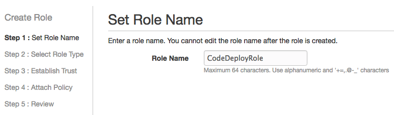
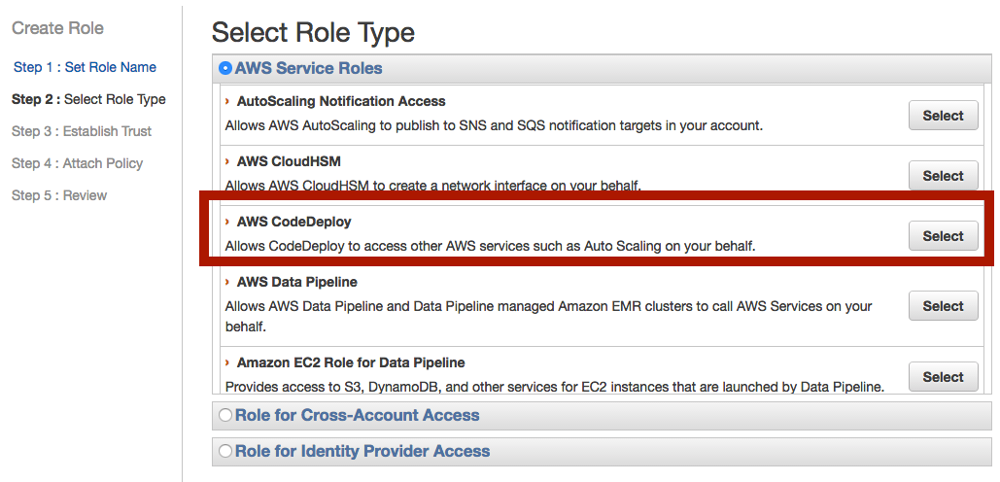
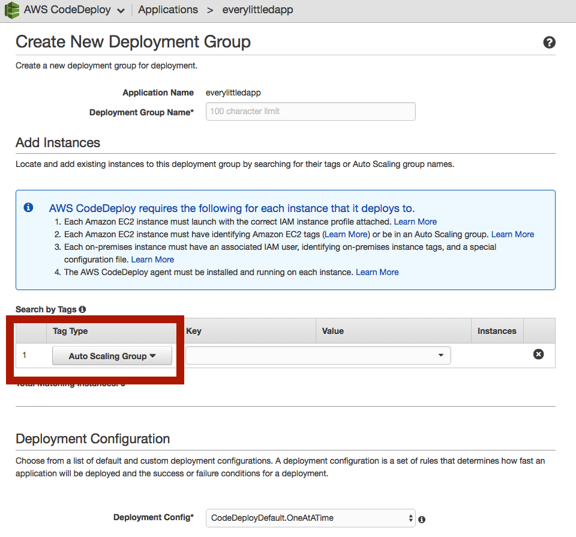
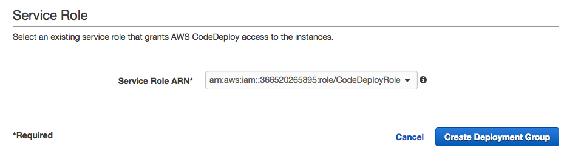

# Auto Scaling 自動部署程式

## 建立 IAM 角色 (Role)

### 設定角色名稱



### 設定角色類型




## 設定 Code Deploy

### 選擇部署機器類型

選擇 Auto Scaling Group，當 Auto Scaling 觸發時，則會自動執行程式部署



### 選擇 Deploy IAM Role




## EC2 Plugin

請先安裝 [AWS CLI](../ec2/cli/ec2-cli-README.md)

### 安裝 CodeDeploy Agent

## Ubuntu 16.04


```shell
sudo apt-get update
sudo apt-get install python-pip
sudo apt-get install ruby
sudo apt-get install wget
cd /home/ubuntu
wget https://bucket-name.s3.amazonaws.com/latest/install
chmod +x ./install
sudo ./install auto
```

|  Region name |  bucket-name replacement |  Region identifier |
|---|---|---|
| US East (Ohio) | aws-codedeploy-us-east-2 | us-east-2 |
| US East (N. Virginia) | aws-codedeploy-us-east-1 | us-east-1 |
| US West (N. California) | aws-codedeploy-us-west-1 | us-west-1 |
| US West (Oregon) | aws-codedeploy-us-west-2 | us-west-2 |
| Canada (Central) | aws-codedeploy-ca-central-1 | ca-central-1 |
| EU (Ireland) | aws-codedeploy-eu-west-1 | eu-west-1 |
| EU (London) | aws-codedeploy-eu-west-2 | eu-west-2 |
| EU (Paris) | aws-codedeploy-eu-west-3 | eu-west-3 |
| EU (Frankfurt) | aws-codedeploy-eu-central-1 | eu-central-1 |
| Asia Pacific (Tokyo) | aws-codedeploy-ap-northeast-1 | ap-northeast-1 |
| Asia Pacific (Seoul) | aws-codedeploy-ap-northeast-2 | ap-northeast-2 |
| Asia Pacific (Singapore) | aws-codedeploy-ap-southeast-1 | ap-southeast-1 |
| Asia Pacific (Sydney) | aws-codedeploy-ap-southeast-2 | ap-southeast-2 |
| Asia Pacific (Mumbai) | aws-codedeploy-ap-south-1 | ap-south-1 |
| South America (São Paulo) | aws-codedeploy-sa-east-1 | sa-east-1 |


### 測試 CodeDeploy Agent

```shell
sudo service codedeploy-agent status
sudo service codedeploy-agent start
```

安裝完 Agent 之後，AWS 才可以透過 Agent 自動部署程式

## 參考資料
* [Install or reinstall the AWS CodeDeploy agent for Ubuntu Server - AWS CodeDeploy](https://docs.aws.amazon.com/codedeploy/latest/userguide/codedeploy-agent-operations-install-ubuntu.html)
* [AWS CodeDeploy Resource Kit Reference - AWS CodeDeploy](https://docs.aws.amazon.com/codedeploy/latest/userguide/resource-kit.html#resource-kit-bucket-names)
* [Install or Reinstall the AWS CodeDeploy Agent - AWS CodeDeploy](http://docs.aws.amazon.com/codedeploy/latest/userguide/how-to-run-agent-install.html)
* [Installing the AWS Command Line Interface - AWS Command Line Interface](http://docs.aws.amazon.com/cli/latest/userguide/installing.html#install-bundle-other-os)
