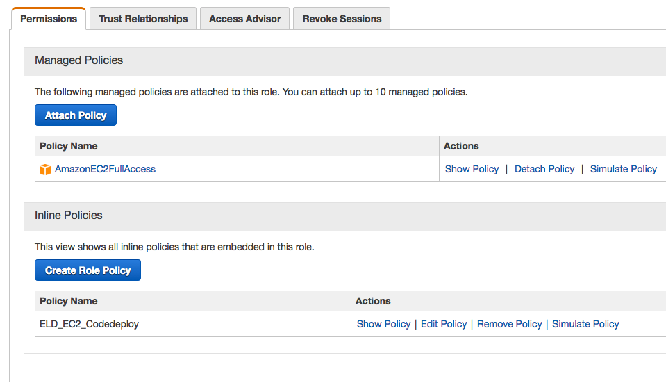
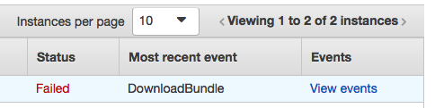
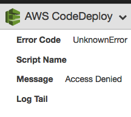
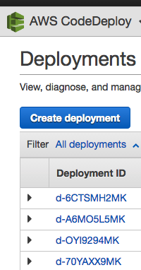
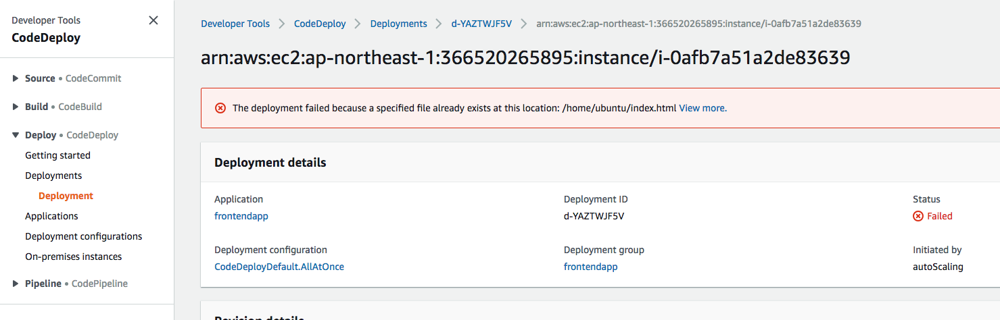

# Code Deploy Debug

## S3

若是把程式放在 S3 的話，記得在 IAM Role 中設定 S3 的存取權限，可以使用 `Attach Polocy` 將 S3 的權限加入，或者可以用 `Inline Policy` 將權限加入，這樣才可以正常 Deploy

```json
{
    "Version": "2012-10-17",
    "Statement": [
      {
          "Action": [
              "s3:Get*",
              "s3:List*"
          ],
          "Effect": "Allow",
          "Resource": "*"
      }
    ]
}
```



若沒有正確的設定權限，則會看到 `DownloadBundle` 的 `Access Denied` 的訊息






## Log

若要看到操作過程的相關 Log，可以到 EC2 下，找到下列目錄，就可以看到相關的存取 Log

#### 流程紀錄

```
less /var/log/aws/codedeploy-agent/codedeploy-agent.log
```

#### 部署記錄

```
less /opt/codedeploy-agent/deployment-root/`deployment-group-ID`/`deployment-ID`/logs/scripts.log
```

 - deployment-group-ID：由 Code Deploy 產生的 Deploy Group 代號
 - deployment-ID：在產生新的 Deploy 時，會有自己特定的部署編號，會長的像 `d-6CTSMH2MK`




## 檢查 Code Deploy 版本

```
cat /opt/codedeploy-agent/.version
agent_version: OFFICIAL_1.0-1.1458_deb
```

## 更新 Code Deploy 版本

```
sudo /opt/codedeploy-agent/bin/install auto
```

## The deployment failed because a specified file already exists at this location: /home/ubuntu/index.html

在使用 Auto Scaling 去做 Code Deploy 時，遇到了檔案權限不能寫入的問題

> The deployment failed because a specified file already exists at this location: /home/ubuntu/index.html




因為在做 AMI 去 Auto Scaling 時，有做了手動 Code Deploy 的測試，所以在 `/home/ubuntu/` 目錄下有建立 Code Deploy 相關的檔案。

要解決這個問題，需要把原先在 `/home/ubuntu/` 目錄 Code Deploy 檔案先移除，在做 AMI 檔案去 Auto Scaling 就可以了

***Code Deploy 相關檔案***

```
codedeploy
    change_permissions
    install_dependencies
appspec.yml
index.html
```


## 參考資料
* [Troubleshoot Instance Issues - AWS CodeDeploy](http://docs.aws.amazon.com/codedeploy/latest/userguide/troubleshooting-ec2-instances.html)
* [View AWS CodeDeploy logs in Amazon CloudWatch console | AWS DevOps Blog](https://aws.amazon.com/blogs/devops/view-aws-codedeploy-logs-in-amazon-cloudwatch-console/)
* [Troubleshoot Deployment Issues - AWS CodeDeploy](http://docs.aws.amazon.com/codedeploy/latest/userguide/troubleshooting-deployments.html)
* [Troubleshoot Deployment Issues - AWS CodeDeploy](https://docs.aws.amazon.com/zh_cn/codedeploy/latest/userguide/codedeploy-agent.html#codedeploy-agent-supported-versions)
* [https://docs.aws.amazon.com/codedeploy/latest/userguide/codedeploy-agent-operations-update-ubuntu.html](Update the AWS CodeDeploy Agent on Ubuntu Server - AWS CodeDeploy)
