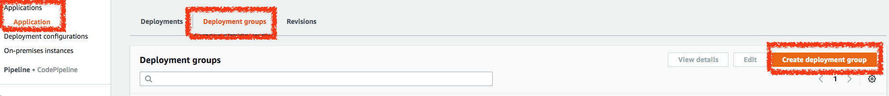

# Deploy 標籤群組

除了在 Code Deploy 使用 Auto Scaling 去 Deploy 程式外，也可以使用 `標籤（Tag）` 的方式去 Deploy 程式到指定 `標籤（Tag）` 的主機。

## 設定 EC2 主機標籤

在主機中設定 EC2 主機的標籤為 `CodeDeployInstance` 並給數值為 `1`

## 建立 Code Deploy 群組

在 Code Deploy 的 `Application > Deployment groups` 中建立 Code Deployment 群組

在建立 Code Deployment 群組中的 `環境設置（Environment configuration）` 中，選擇 `Amazon EC2 instances`，並設定 EC2 主機的標籤為 `CodeDeployInstance` 並給數值為 `1`

取消啟用 Load Balancer

## 建立 Code Deploy

建立 Code Deploy

在 Code Deploy 選擇剛剛建立的 Code Deploy 群組

