# 建立 Auto Scaling

# 建立設定檔

Auto Scaling / Launch Configurations / Create launch configuration

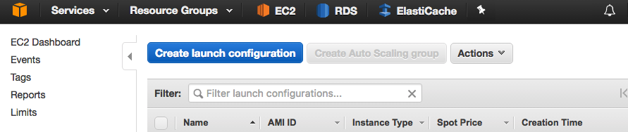

## 選擇自己的 AMI 映像檔

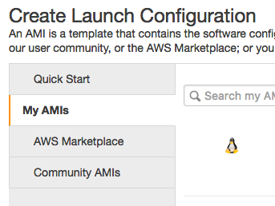

## 選擇機器類型

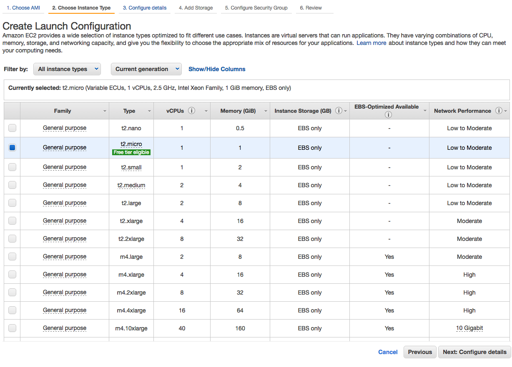

## 設定細節

設定設定檔名稱
若有選擇用 Spot Instance 的話，則需要設定最大出價價格（上方為目前的 spot instance 目前價格）

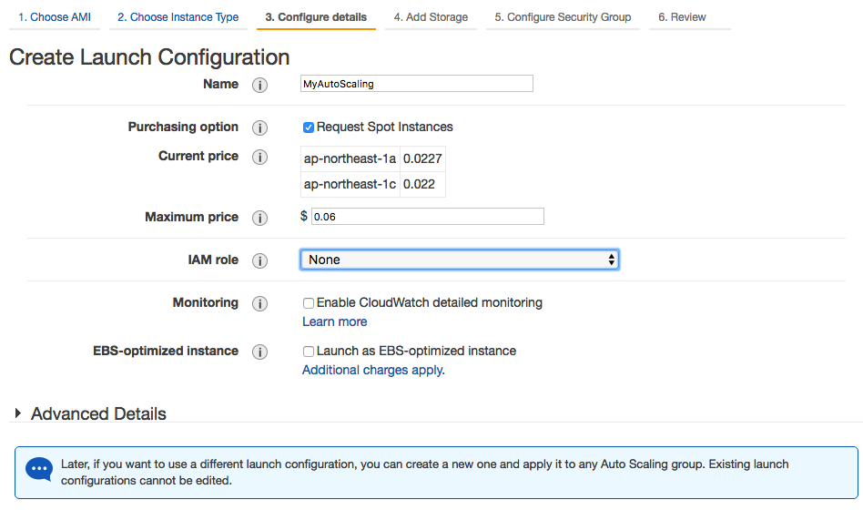

## 設定儲存空間

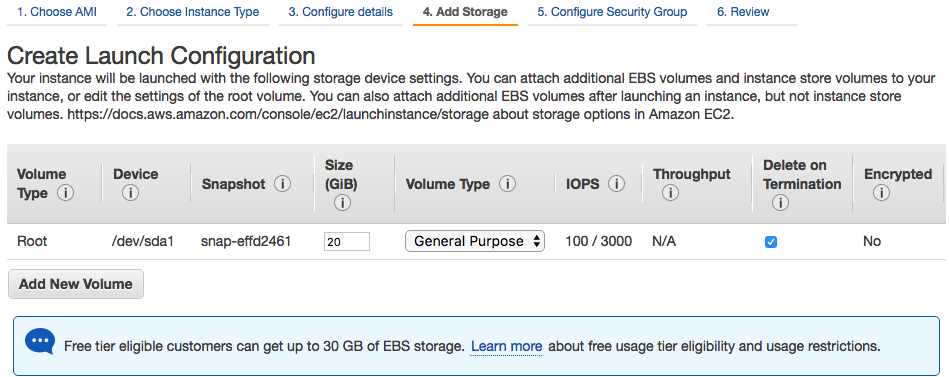

## 設定 Security Group

通常會設定 22 (SSH)、80 (HTTP) 與 443 (HTTPS)

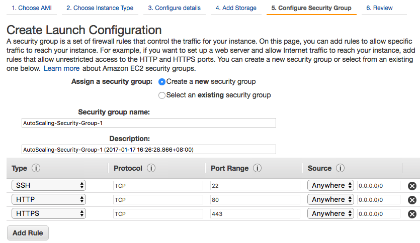

## 建立 Auto Scaling Group

Auto Scaling / Auto Scaling Groups / Create Auto Scaling group

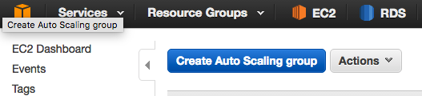

## 選擇設定檔

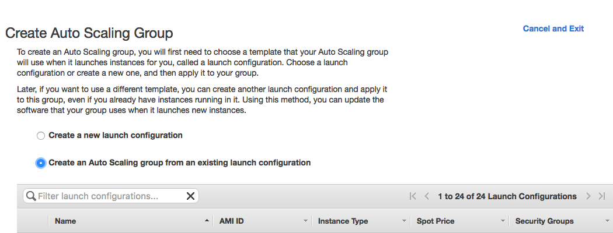

## 建立 Group

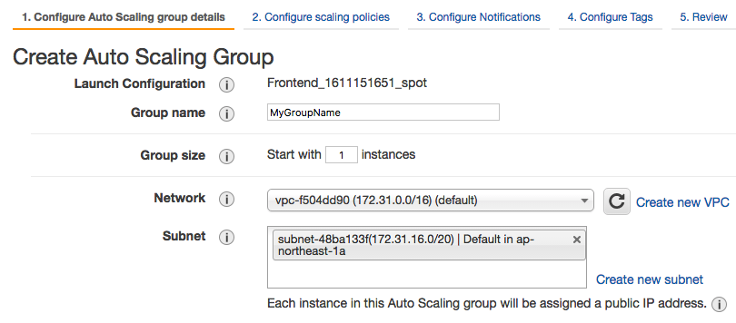

## 建立 Scaling 條件

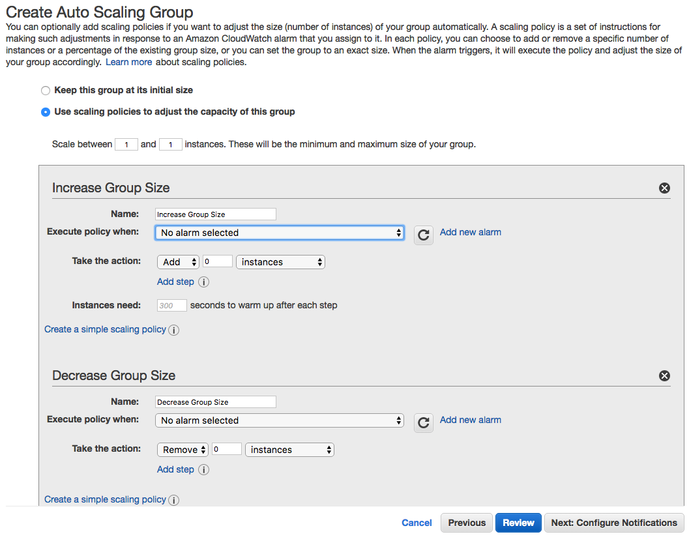

## 設定 Scaling 的機器在哪些 Load Balancer 下面

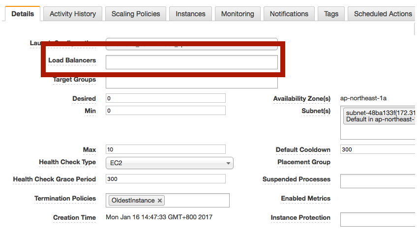

