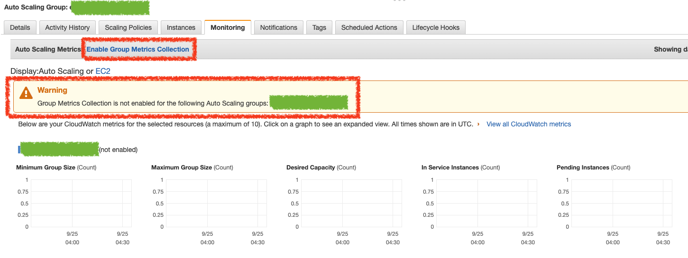

# Auto Scaling Monitoring

在監控 Auto Scaling Group 時會看不到想要監控的數據，而下面會顯示警告

> Group Metrics Collection is not enabled for the following Auto Scaling groups:

此時若想要看到此監控的數據，可以點選上方的 `Enable Group Metrics Collection` 連結，即可啟用數據監控，在 Cloudwatch 那邊看到資料了

## 參考資料
* [Monitoring Your Auto Scaling Groups and Instances Using Amazon CloudWatch - Amazon EC2 Auto Scaling](https://docs.aws.amazon.com/autoscaling/ec2/userguide/as-instance-monitoring.html)
