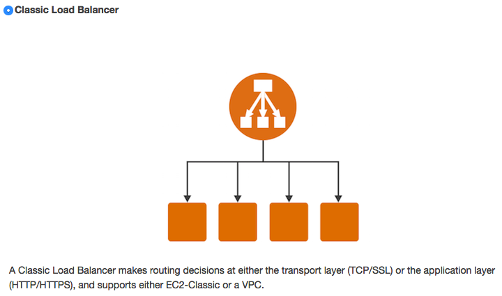
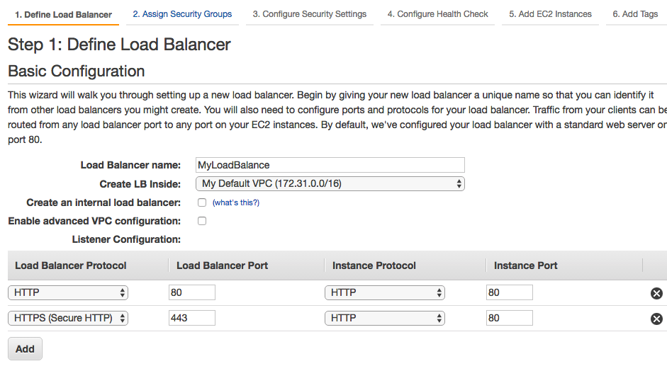
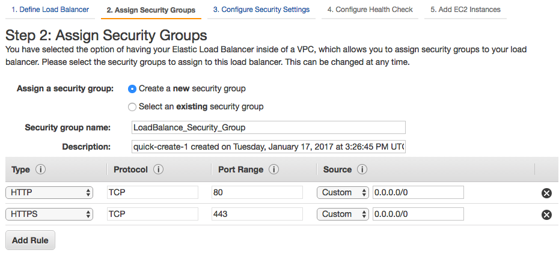
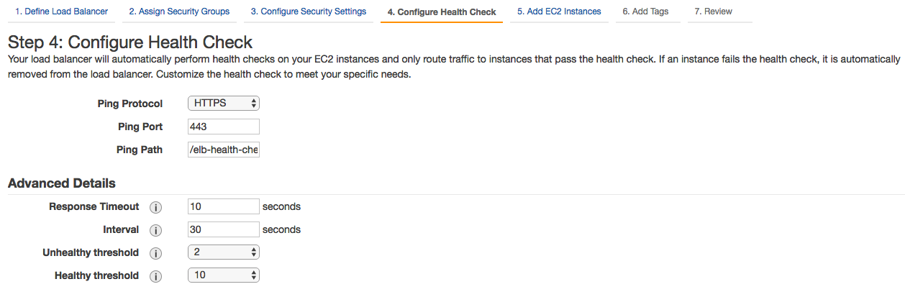
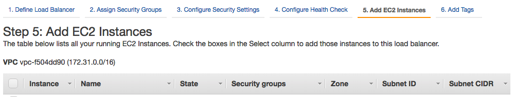

# 建立 Load Balancer

## 選擇建立類型

在 Load Balancer 頁面點選 `Create Load Balancer`

## 定義

* Load Balancer name : Load Balancer 名稱
* Listener Configuration : Listen 的 port
* Select Subnets: 選擇允許的子網路遮罩

## Security Group

建立 Load Balancer 的 Security Group
通常開放 80 (HTTP) 與 443 (HTTPS) 即可

## 設定機器狀態檢查網址

## 手動設定 EC2 機器

將指定的機器加入到 Load Balancer Instance 清單中
若沒有機器的話，可以使用 Auto Scaling 的方式自動加入該機器

