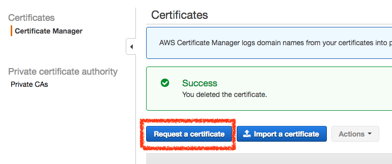
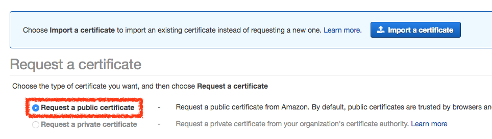
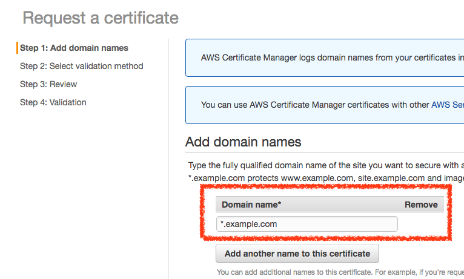
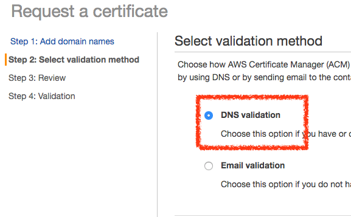
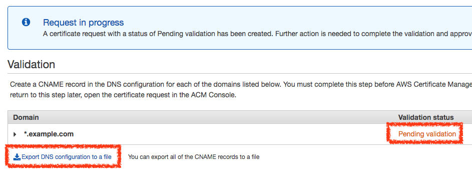
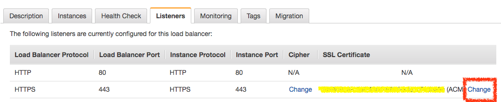

# Load Balancer SSL

## AWS Certificate Manager

> 透過 AWS Certificate Manager 佈建的公有 SSL/TLS 憑證無須付費。您只需支付為執行應用程式而建立的 AWS 資源的費用。

### 公有憑證

> 成功驗證憑證請求中的網域名稱擁有權或控制權之後，就會發行 SSL/TLS 憑證。您可以部署此憑證以用於 Elastic Load Balancers、Amazon CloudFront 分發或 Amazon API Gateway 上的 API。只要從 AWS 管理主控台的下拉式清單中選取所需的 SSL/TLS 憑證即可

*公有憑證使用地方*

* Elastic Load Balancers
* Amazon CloudFront
* Amazon API Gateway

### 建立公有憑證

### 請求憑證

### 設定憑證網址

### 設定憑證網址驗證方式

* DNS 驗證
* Email 驗證

### 下載網址驗證資料

下載 csv 檔案，將其中的 CNAME DNS 設定到你的網域，過幾分鐘即可驗證成功

### 變更 Load Balancer SSL 憑證

在 Listeners tab 中的 HTTPS 可以選擇憑證類型，選擇剛剛建立驗證成功的憑證即可。

## 參考資料
* [AWS Certificate Manager 定價](https://aws.amazon.com/tw/certificate-manager/pricing/)
* [AWS Certificate Manager 入門](https://aws.amazon.com/tw/certificate-manager/getting-started/)
* [AWS Certificate Manager 常見問題](https://aws.amazon.com/tw/certificate-manager/faqs/)
* [AWS Certificate Manager](https://ap-northeast-1.console.aws.amazon.com/acm/home?region=ap-northeast-1#/)
* [Load Balancer Certificate](https://aws.amazon.com/tw/premiumsupport/knowledge-center/load-balancer-certificate/)
* [Replace the SSL Certificate for Your Classic Load Balancer - Elastic Load Balancing](https://docs.aws.amazon.com/elasticloadbalancing/latest/classic/elb-update-ssl-cert.html)
