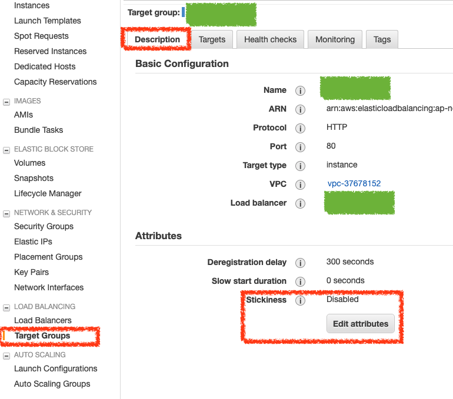
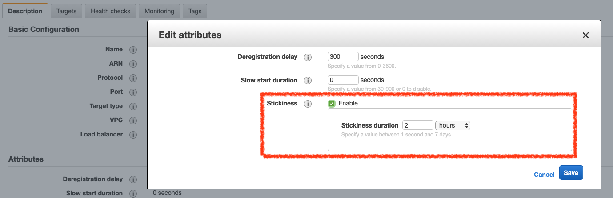

# AWS Load Balancer Stickiness

在 AWS Load Balancer 中可以看到 Stickness 的設定，開啟 Stickness 表示 Load Balancer 會針對同一個使用者的請求，會使用指向同一台 EC2 機器。

## Classic Load Balancer

在 Stickness 設定視窗中你會看到有三個設定方式

 1. Disable stickiness
 2. Enable load balancer generated cookie stickiness
 3. Enable application generated cookie stickiness

### Stickness 設定方式

「Load Balancer」與「application generated」設定方式的差異分別如下

#### Enable Load Balancer Generated Cookie Stickiness

Load Balancer 會自己加入一個自己的 Cookie 資訊到瀏覽器，並設定 Cookie 的失效時間，Load Balancer 會自行控制該 Cookie 的狀況

#### Enable application generated cookie stickiness

Load Balancer 會針對使用者自己網站的 cookie，去分配流量到機器的狀況，由使用者自己網站的應用程式自行去控制 Cookie 的過期時間，所以需要自行設定網站 cookie 的名稱。

## Application Load Balancer

在 `Target Group` 選擇 `Description` 頁籤，在下方的 `Stickiness` 點選 `Edit attributes` 按鈕

在設定視窗設定 Stickiness 的時間即可

## 參考資料
* [amazon ec2 - EC2 load balancer - difference between "Load Balancer" and "Application" Generated Cookie Stickiness - Server Fault](https://serverfault.com/questions/435431/ec2-load-balancer-difference-between-load-balancer-and-application-generat)
* [New Elastic Load Balancing Feature: Sticky Sessions | AWS News Blog](https://aws.amazon.com/blogs/aws/new-elastic-load-balancing-feature-sticky-sessions/)
* [Configure Sticky Sessions for Your Classic Load Balancer - Elastic Load Balancing](http://docs.aws.amazon.com/elasticloadbalancing/latest/classic/elb-sticky-sessions.html)
* [Target Groups for Your Application Load Balancers - Elastic Load Balancing](https://docs.aws.amazon.com/elasticloadbalancing/latest/application/load-balancer-target-groups.html)
