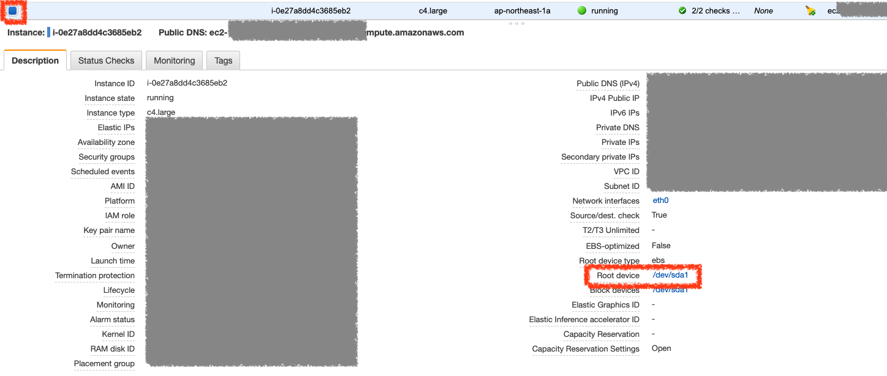
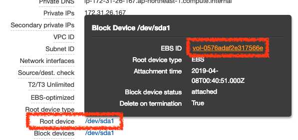
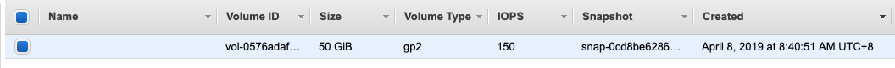
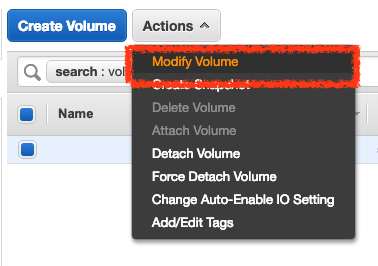
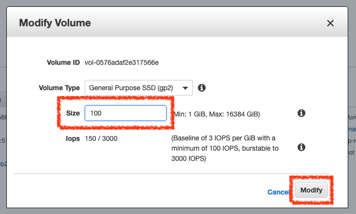

# 增加 EC2 硬碟空間

要增加 EC2 的硬碟空間，可以直接修改 Elastic Volume 的大小，並在主機內下指令即可立即變更硬碟空間大小


***1. 從 EC2 找出 Elastic Volume***






***2. 修改 Elastic Volume 大小***







***3. 檢視目前硬碟空間配置***

修改完 Elastic Volume 後，使用 `df -h` 可以看到目前的硬碟空間還是沒有變的

```
$ df -h
Filesystem      Size  Used Avail Use% Mounted on
udev            992M     0  992M   0% /dev
tmpfs           200M   14M  187M   7% /run
/dev/xvda1       49G   36G   14G  73% /
tmpfs          1000M     0 1000M   0% /dev/shm
tmpfs           5.0M     0  5.0M   0% /run/lock
tmpfs          1000M     0 1000M   0% /sys/fs/cgroup
/dev/loop0       18M   18M     0 100% /snap/amazon-ssm-agent/1068
/dev/loop1       18M   18M     0 100% /snap/amazon-ssm-agent/930
/dev/loop2       92M   92M     0 100% /snap/core/6531
/dev/loop3       90M   90M     0 100% /snap/core/6673
/dev/loop4       91M   91M     0 100% /snap/core/6405
/dev/loop5       17M   17M     0 100% /snap/amazon-ssm-agent/784
tmpfs           200M     0  200M   0% /run/user/1001
tmpfs           200M     0  200M   0% /run/user/1003
tmpfs           200M     0  200M   0% /run/user/1010
tmpfs           200M     0  200M   0% /run/user/1002
```

使用 `lsblk` 可以看到 `xvda` 的空間已經變成我們修改的 100G 了，但目前還無法使用


> xvda    202:0    0  100G  0 disk

> \`-xvda1 202:1    0   50G  0 part /

```
$ lsblk
NAME    MAJ:MIN RM  SIZE RO TYPE MOUNTPOINT
xvda    202:0    0  100G  0 disk
`-xvda1 202:1    0   50G  0 part /
loop0     7:0    0 17.9M  1 loop /snap/amazon-ssm-agent/1068
loop1     7:1    0   18M  1 loop /snap/amazon-ssm-agent/930
loop2     7:2    0 91.1M  1 loop /snap/core/6531
loop3     7:3    0 89.3M  1 loop /snap/core/6673
loop4     7:4    0   91M  1 loop /snap/core/6405
loop5     7:5    0 16.5M  1 loop /snap/amazon-ssm-agent/784
```

***4. 擴展可用的硬碟空間配置***

使用 `sudo growpart /dev/xvda 1` 擴展可用的硬碟空間配置

```
$ sudo growpart /dev/xvda 1
[sudo] password for kejyun:
CHANGED: partition=1 start=2048 old: size=104855519 end=104857567 new: size=209713119,end=209715167
```

擴展後可以看到目前的可用空間已經擴展至 100 G 了

> xvda    202:0    0  100G  0 disk

> \`-xvda1 202:1    0  100G  0 part /


```
$ lsblk
NAME    MAJ:MIN RM  SIZE RO TYPE MOUNTPOINT
xvda    202:0    0  100G  0 disk
`-xvda1 202:1    0  100G  0 part /
loop0     7:0    0 17.9M  1 loop /snap/amazon-ssm-agent/1068
loop1     7:1    0   18M  1 loop /snap/amazon-ssm-agent/930
loop2     7:2    0 91.1M  1 loop /snap/core/6531
loop3     7:3    0 89.3M  1 loop /snap/core/6673
loop4     7:4    0   91M  1 loop /snap/core/6405
loop5     7:5    0 16.5M  1 loop /snap/amazon-ssm-agent/784
```

***5. 重新配置可用的硬碟空間***

使用 `sudo resize2fs /dev/xvda1` 指令重新配置可用的硬碟空間

```
$ sudo resize2fs /dev/xvda1
resize2fs 1.42.13 (17-May-2015)
Filesystem at /dev/xvda1 is mounted on /; on-line resizing required
old_desc_blocks = 4, new_desc_blocks = 7
The filesystem on /dev/xvda1 is now 26214139 (4k) blocks long.
```

重新配置完成後，可以看到 `/dev/xvda1` 的空間已經變成 100G 了

> /dev/xvda1       97G   36G   62G  37% /

```
$ df -h
Filesystem      Size  Used Avail Use% Mounted on
udev            992M     0  992M   0% /dev
tmpfs           200M   14M  187M   7% /run
/dev/xvda1       97G   36G   62G  37% /
tmpfs          1000M     0 1000M   0% /dev/shm
tmpfs           5.0M     0  5.0M   0% /run/lock
tmpfs          1000M     0 1000M   0% /sys/fs/cgroup
/dev/loop0       18M   18M     0 100% /snap/amazon-ssm-agent/1068
/dev/loop1       18M   18M     0 100% /snap/amazon-ssm-agent/930
/dev/loop2       92M   92M     0 100% /snap/core/6531
/dev/loop3       90M   90M     0 100% /snap/core/6673
/dev/loop4       91M   91M     0 100% /snap/core/6405
/dev/loop5       17M   17M     0 100% /snap/amazon-ssm-agent/784
tmpfs           200M     0  200M   0% /run/user/1001
tmpfs           200M     0  200M   0% /run/user/1003
tmpfs           200M     0  200M   0% /run/user/1010
tmpfs           200M     0  200M   0% /run/user/1002
```

## 參考資料
* [Increasing your EC2 Volume Size | Amimoto Help Center](https://support.amimoto-ami.com/english/self-hosting-accounts/increasing-your-ec2-volume-size)
