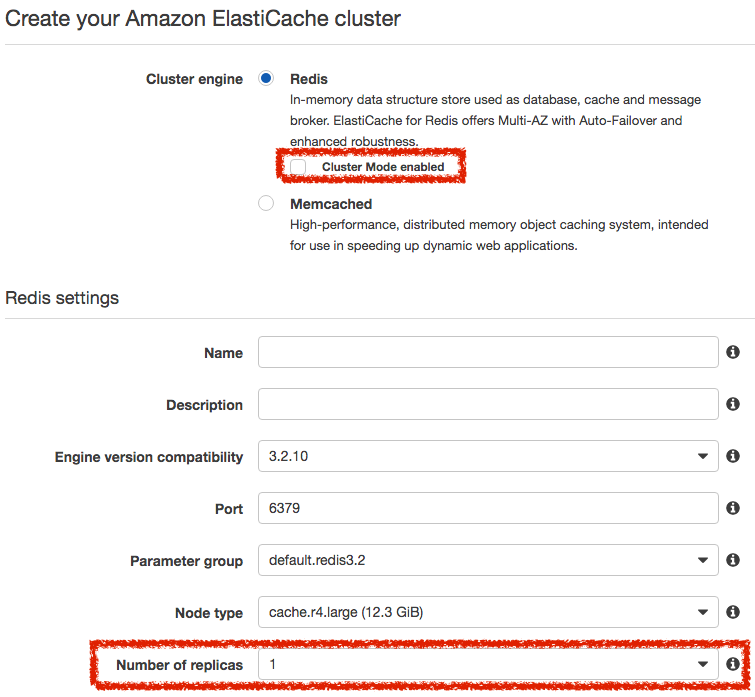

# ElastiCache Redis

## AWS Redis Cluster

AWS 群集模式參考架構（來源：AWS）

**Cluster Mode Enable 啟用群集模式**

將同一個資料做不同的分片（Shared），而不同的分片會有自己的備援（Replica）

**Cluster Mode Disable 禁用群集模式**

同一個資料僅有一個分片，自己的分片可以建立自己的備援（Replica）

## AWS Redis Cluster Mode Enable 啟用群集模式

### 建立 Redis AWS Cluster Mode Enable 群集

建立 AWS Cluster Mode Enable 群集，將「Cluster Mode enabled」打勾，在下方的「Number of Shareds」設定資料分片數量，以及在「Replicas per Shared」設定每個分片數量要有幾個備援。

### 取得群集端點（Configuration Endpoint）

建立完群集之後，在列表中取得群集端點（Configuration Endpoint）。

### 群集分片

建立完後會看到君集裡面有群集分片，分別去放置不同資料位置的資料。

### 新增群集分片

群集分片可以隨自己的主機負載狀況去做新增，在新增時主機會呈現 modifying 的狀態，在新增修改分片期間，Redis 還是能夠正常的被存取，不會受到影響。

在新增群集分片完成後，資料群集分片會再被切割。

### 移除群集分片

群集分片可以隨時的移除。

在移除後，原本的資料群集分片資料，會再被統整合併到現有的群集內。

### 移除群集分片後再加入新分片節點

移除群集分片後再加入新分片節點後，會看到新增的群集會再去重新分配現有的群集分片資料

## AWS Redis Cluster Mode Disable 禁用群集模式

### 建立 Redis AWS Cluster Mode Disable 群集

建立 AWS Cluster Mode Disabled 群集，將「Cluster Mode enabled」取消勾選，以及在「Number of replicas」設定要有幾個備援節點。

### 取得群集端點（Primary Endpoint）

建立完群集之後，在列表中取得群集端點（Primary Endpoint）。

### 群集端點（Nodes）

在群集內可以看到有主要群集端點（Primary）跟備援群集端點（Replica），備援群集端點（Replica）的資料跟主群集端點（Primary）一樣，只是會做到讀寫分離。

### 建立新群集端點

備援群集端點（Replica）可以隨機器狀況調整隨時新增刪除去調整。

## 參考資料
* [复制：Redis (已禁用集群模式) 与 Redis (已启用集群模式) - Amazon ElastiCache](https://docs.aws.amazon.com/zh_cn/AmazonElastiCache/latest/UserGuide/Replication.Redis-RedisCluster.html)
* [选择引擎：Memcached、Redis (已禁用集群模式) 或 Redis (已启用集群模式) - Amazon ElastiCache](https://docs.aws.amazon.com/zh_cn/AmazonElastiCache/latest/UserGuide/SelectEngine.Uses.html)