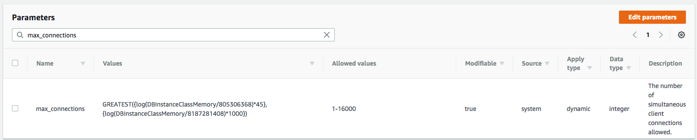

# RDS 實例限制

## 資料庫連線數量 RDS Database Connections Limit

RDS 連線數量是依照主機的記憶體大小限制最大數量，如果有需要更多的連線數量，則需要加開機器去增加連線數量。

*AWS Aurora MySQL*

> Aurora MySQL max_connections limit 最大連線數量限制: GREATEST({log(DBInstanceClassMemory/805306368)*45},{log(DBInstanceClassMemory/8187281408)*1000})

| 實例類型 (Instance Class)  | 連線數量限制 (max_connections Default Value)  |
|---|---|
| db.t2.small | 45 |
| db.t2.medium | 90 |
| db.r3.large | 1000 |
| db.r3.xlarge | 2000 |
| db.r3.2xlarge | 3000 |
| db.r3.4xlarge | 4000 |
| db.r3.8xlarge | 5000 |
| db.r4.large | 1000 |
| db.r4.xlarge | 2000 |
| db.r4.2xlarge | 3000 |
| db.r4.4xlarge | 4000 |
| db.r4.8xlarge | 5000 |
| db.r4.16xlarge | 6000 |

*AWS Aurora PostgreSQL*

> Aurora PostgreSQL max_connections limit 最大連線數量限制: LEAST({DBInstanceClassMemory/9531392},5000)

| 實例類型 (Instance Class)  | 連線數量限制 (max_connections Default Value)  |
|---|---|
| db.r4.large  | 1600 |
| db.r4.xlarge  | 3200 |
| db.r4.2xlarge  | 5000 |
| db.r4.4xlarge  | 5000 |
| db.r4.8xlarge  | 5000 |
| db.r4.16xlarge  | 5000 |

***參考資料***

* [Too many connections on AWS Aurora db.t2.medium database - Atlassian Documentation](https://confluence.atlassian.com/bamkb/too-many-connections-on-aws-aurora-db-t2-medium-database-938020305.html)
* [管理 Amazon Aurora MySQL - Amazon Relational Database Service](https://docs.aws.amazon.com/zh_cn/AmazonRDS/latest/UserGuide/AuroraMySQL.Managing.html#AuroraMySQL.Managing.MaxConnections)
* [mysql - Highest value of max_connections in AWS RDS micro instance - Server Fault](https://serverfault.com/questions/599421/highest-value-of-max-connections-in-aws-rds-micro-instance)
* [Should I increase max_connections in AWS RDS t1-micro for MySQL? - Database Administrators Stack Exchange](https://dba.stackexchange.com/questions/41829/should-i-increase-max-connections-in-aws-rds-t1-micro-for-mysql)
* [AWS RDS 在各 instance type 的 max_connections 的定義 | Mr. 沙先生](https://shazi.info/aws-rds-%E5%9C%A8%E5%90%84-instance-type-%E7%9A%84-max_connections-%E7%9A%84%E5%AE%9A%E7%BE%A9/)