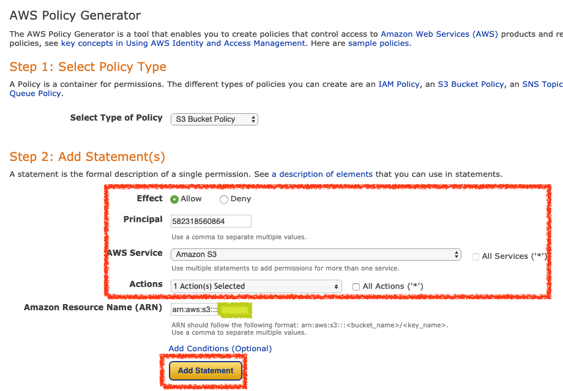
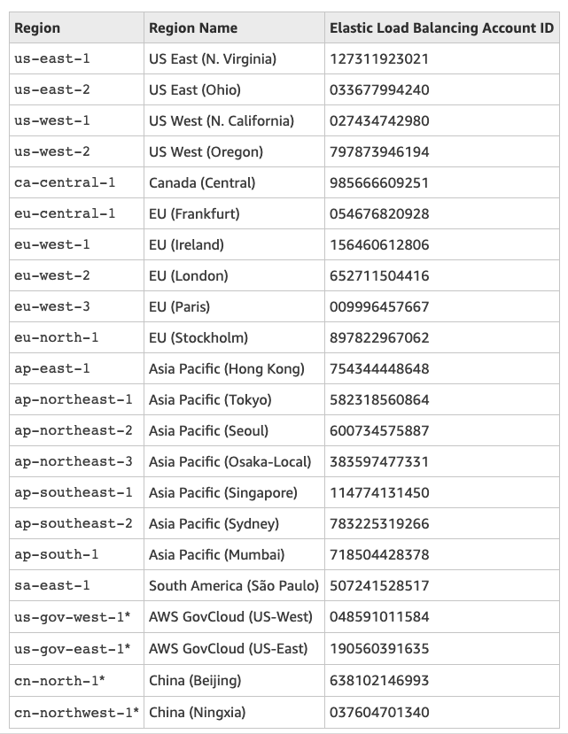
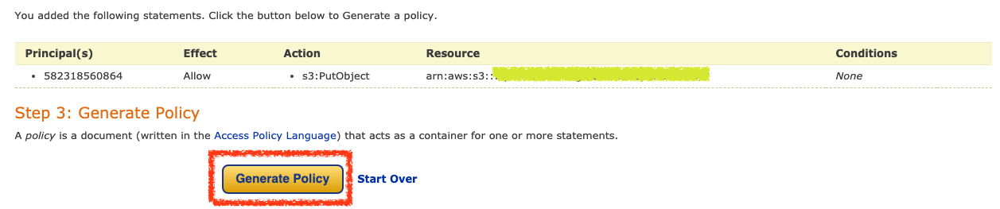
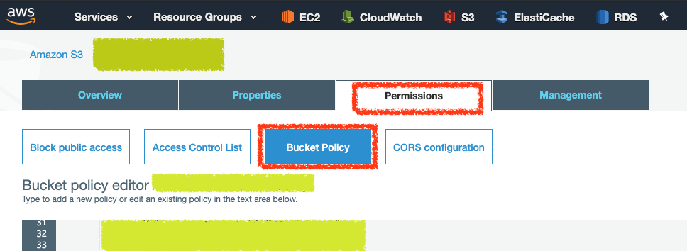

# S3 ARN Policy

建立可以存取 S3 Bucket 的 ARN 權限

到 [AWS Policy Generator](https://awspolicygen.s3.amazonaws.com/policygen.html) 產生可以存取 S3 的權限 Policy



`Effect` 選擇 `Allow`

`Principal` 填寫所在區域的 `Elastic Load Balancing Account ID`，像在東京就填寫 `582318560864`，詳細 id 範例如下




`AWS Service` 選擇 `Amazon S3`

`Action` 選擇指定權限

`Amazon Resource Name (ARN)` 填寫的樣式會像是

```
arn:aws:s3:::bucket/prefix/AWSLogs/aws-account-id/*
```

`bucket/prefix/AWSLogs` 填寫允許存取哪一個 `bucket` 路徑即可，範例會像是

```
arn:aws:s3:::kejyun-bucket/ec2-alb-web/*
```

表示在 Bucket `kejyun-bucket` 下的 `ec2-alb-web` 目錄可以存取

完成後點選 `Generate Policy` 按鈕即可產生 Policy





產生完的 Policy 會像是

```
{
  "Id": "Policy1561544116661",
  "Version": "2012-10-17",
  "Statement": [
    {
      "Sid": "Stmt1561542985535",
      "Action": [
        "s3:PutObject"
      ],
      "Effect": "Allow",
      "Resource": "arn:aws:s3:::kejyun-bucket/ec2-alb-web/*",
      "Principal": {
        "AWS": [
          "582318560864"
        ]
      }
    }
  ]
}
```


之後到 `AWS S3 Bucket` 選擇 `Permissions` 頁籤，點選 `Bucket Policy`，將產生的 Policy 貼到下方儲存即可




## 參考資料
* [Access Logs for Your Application Load Balancer - Elastic Load Balancing](https://docs.aws.amazon.com/elasticloadbalancing/latest/application/load-balancer-access-logs.html)
* [AWS Policy Generator](https://awspolicygen.s3.amazonaws.com/policygen.html)
