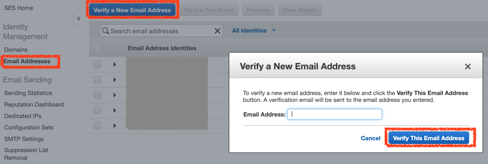
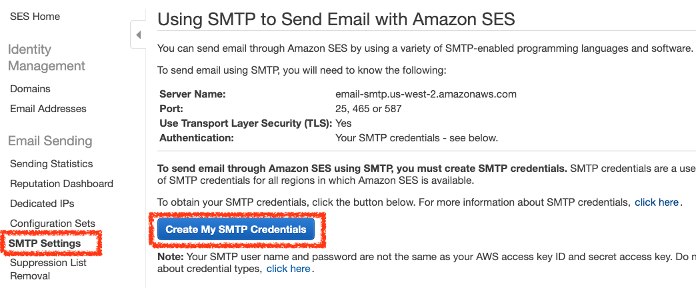
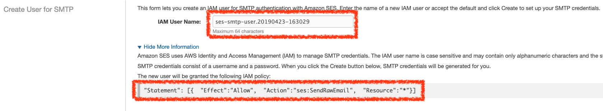
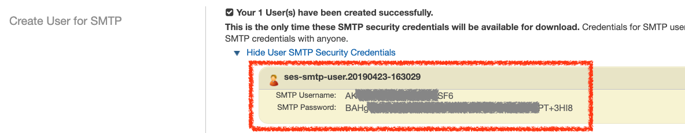
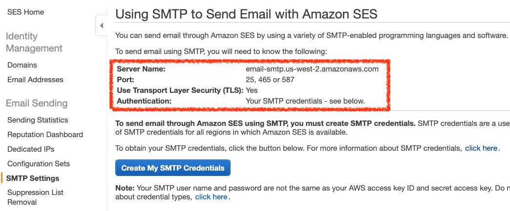

# Simple Email Service (SES)

## 驗證寄信 Email

要使用指定的 Email 寄送信件時，AWS SES 需要驗證此信箱是否為正確的信箱

在左側 `Identity Management` 選單中，點選 `Email Addresses`，在右側頁面點選 `Verify a New Email Address` 按鈕，輸入您要用來寄送的 Email，然後點選 `Verify This Email Address` 按鈕驗證此 Email 的正確性




## SES 使用 SMTP 寄送信件

*建立 SMTP 憑證*

點選選單 `Email Sending` > `SMTP Settings` 頁籤，點選 `Create My SMTP Credentials` 按鈕建立 IAM 使用者可以存取 SES 服務



```json
{
    "Statement": [
        {  
            "Effect":"Allow",  
            "Action":"ses:SendRawEmail",  
            "Resource":"*"
        }
    ]
}
```

*設定 IAM 使用者帳號名稱*

設定可以存取 SES 的 IAM 使用者的帳號名稱




*取得 SES IAM 使用者 Access Key*

設定完成之後可以取得此 IAM 使用者的 Access Key




將取得得 Access Key 當作 SMTP 的帳號密碼登入即可寄信


*寄信設定檔*

`MAIL_HOST` 看看您的 SES 是使用放在哪個區域，依照 AWS 提供的區域設定進行設定即可開始寄信

```
# SES
MAIL_DRIVER=smtp
MAIL_HOST=email-smtp.us-west-2.amazonaws.com
MAIL_PORT=587
MAIL_ENCRYPTION=tls
MAIL_USERNAME="SMTP Username"
MAIL_PASSWORD="ses-create-smtp-credentials Password"
```


